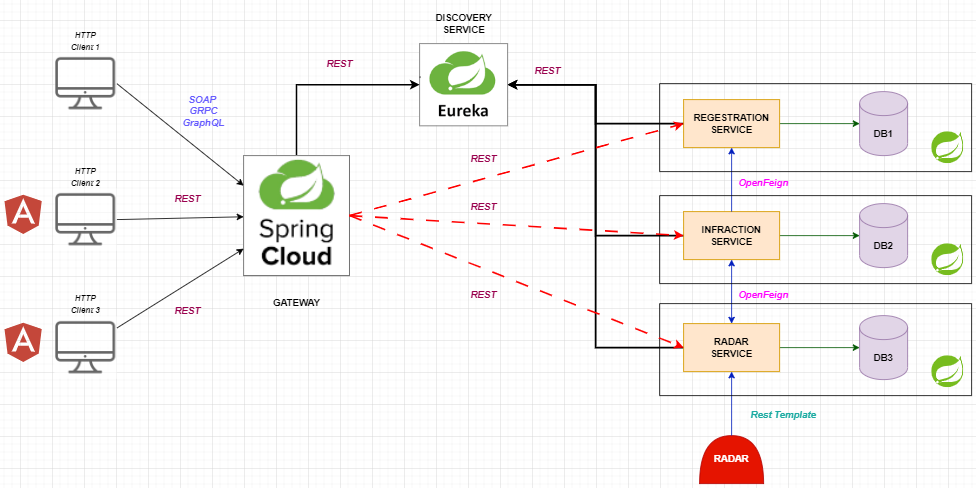
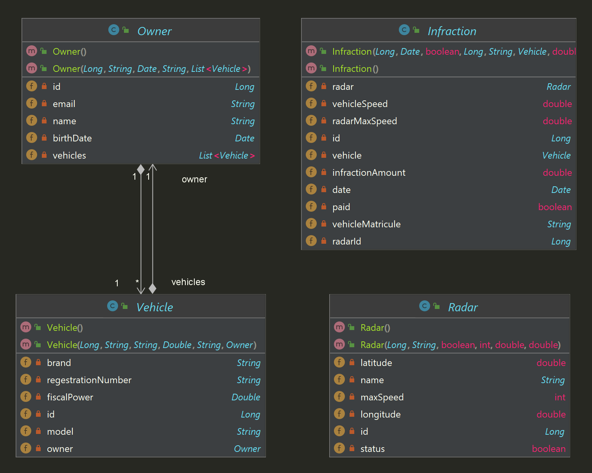

# Radar Violation Detection System

```
This is a web-based application built using Spring Boot and Angular. It is a radar violation detection system
It aims to detect and track radar violations, providing real-time notifications and reporting reporting for 
efficient traffic management. 
The backend is built using Spring Boot , while the frontend is built using Angular with Bootstrap for the user 
interface.
```

# Table of Contents       
- [Getting Started](#getting-started)
    - [Prerequisites](#prerequisites)
    - [Installation](#installation)
- [Features](#features)
- [Technologies Used](#technologies-used)
- [License](#license) 


## Getting Started    
### Prerequisites  
Before running this application, you need to have the following software installed on your system:    

- Java Development Kit (JDK) version 11 or later  
- Node.js version 14 or later  
- Angular CLI version 13 or later   
### Installation  
Follow these steps to install and run the application:

1. Clone the repository:   
```  
git clone https://github.com/Abdellah-belcaid/book-store-management.git
```    
2. Navigate to the backend directory and run the following command to start the Spring Boot application:   
```  
./mvnw spring-boot:run   
```    
3. Navigate to the frontend directory and run the following command to install the required packages:   
```    
npm install   
```    
4. After the packages are installed, run the following command to start the Angular application:   
```    
ng serve   
```    
5. Open your browser and navigate to http://localhost:4200 to access the application.     

### Features   
The following features are implemented in this application:    

- User authentication using JWT  
- Authorization and role-based access control using Spring Security   
- CRUD operations for books and authors   
- Ordering books    
- Responsive UI using Angular Material  
### Technologies Used   
The following technologies and frameworks are used in this application:

- Spring Boot  
- Spring Security  
- JWT  
- Angular 
- Angular Material  
- MySQL 
### Contributing  
If you want to contribute to this project, please follow these steps:

1. Fork the repository  
2. Create a new branch (git checkout -b feature/your-feature)  
3. Make changes and commit them (git commit -m 'Add your feature')   
4. Push the changes to your branch (git push origin feature/your-feature)   
5. Create a pull request   
# License  
- This project is licensed under the GNU General Public License v3.0 - see the LICENSE file for details.
## 1. Project Architecture



## 2. Class Diagram




## Licence
This project is licensed under the GNU General Public License v3.0 - see the LICENSE file for details.
